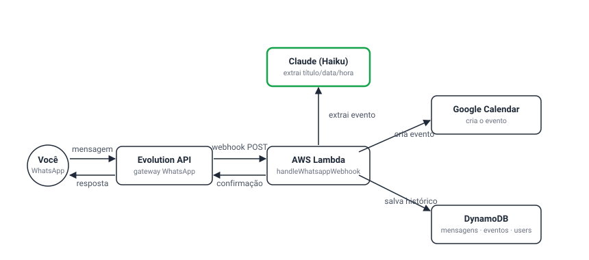

<p align="right">
  <a href="README.pt-BR.md">Português</a> | <a href="README.md">English</a>
</p>

# WhatsNext

[](https://github.com/marcelomds/whatsnext/actions/workflows/ci.yml)

**Serverless WhatsApp scheduling assistant powered by Claude AI and Google Calendar — running live on AWS.**

Send a message like *"Next Monday 2pm, meeting with John"* to a connected WhatsApp
number, and it shows up on Google Calendar automatically. No app, no bot commands —
just natural language.

<p align="center">
  
</p>

## ✨ Features

- ✅ Real WhatsApp number, connected via QR code from the web panel (Evolution API)
- ✅ Self-only by design — only messages from `AUTHORIZED_PHONE_NUMBER` are processed; anyone else texting the number is silently ignored, no auto-replies to strangers
- ✅ Message yourself to schedule — the WhatsApp "message yourself" pattern works (a self-sent message is a command, not an echo)
- ✅ Natural-language message → Claude extracts title, date, time and duration
- ✅ Event created automatically on Google Calendar, confirmation sent back on WhatsApp
- ✅ Messages unrelated to scheduling (small talk, "hi", introducing your name) are classified as `not_an_event` and get no reply at all — only asks for clarification when you're actually trying to schedule something
- ✅ JWT auth (register/login) — each account owns its own WhatsApp instance
- ✅ Web panel (React + TypeScript) — light/indigo theme, EN/PT language toggle, connect/disconnect WhatsApp, events list + month calendar view, next-event highlight card
- ✅ Deployed for real on AWS — backend on Lambda + API Gateway + DynamoDB, frontend on S3 + CloudFront (HTTPS)
- ✅ Local dev stack via Docker Compose (DynamoDB Local + admin UI)
- ✅ CI on every push (backend tests + frontend build)

## 🚀 Quick Start (local)

```bash
# 1. Clone and install
git clone https://github.com/marcelomds/whatsnext.git
cd whatsnext
npm install

# 2. Configure environment variables
cp .env.example .env
# fill in .env with your credentials (see docs/SETUP.md for how to get each one)

# 3. Start local DynamoDB + admin UI
docker compose up -d dynamodb-local dynamodb-admin
node scripts/create-dynamodb-tables.js

# 4. Run tests
npm test

# 5. Start the backend (Serverless Offline) — needs Node 18 (`nvm use 18`)
npm run dev

# 6. Start the panel — needs Node 20.12+ (`nvm use 20`), different from the backend
cd apps/frontend && cp .env.example .env && npm install && npm run dev
```

Full step-by-step guide: [docs/SETUP.md](docs/SETUP.md).

## 📁 Project Structure

```
whatsnext/
├── apps/
│   ├── backend/
│   │   ├── src/
│   │   │   ├── handlers/
│   │   │   │   └── whatsapp-handler.js      (Lambda entry points)
│   │   │   ├── controllers/
│   │   │   │   ├── auth.controller.js       (register/login/me)
│   │   │   │   ├── instance.controller.js   (connect/status/disconnect)
│   │   │   │   ├── messages.controller.js
│   │   │   │   └── events.controller.js
│   │   │   ├── services/
│   │   │   │   ├── claude.service.js        (Claude integration)
│   │   │   │   ├── calendar.service.js      (Google Calendar)
│   │   │   │   ├── whatsapp.service.js      (Evolution API)
│   │   │   │   ├── dynamodb.service.js      (Database)
│   │   │   │   └── auth.service.js          (JWT + bcrypt)
│   │   │   └── utils/
│   │   │       ├── with-auth.js             (JWT guard for Lambda handlers)
│   │   │       ├── evolution-payload.js     (parses the real webhook shape)
│   │   │       ├── logger.js
│   │   │       ├── error-handler.js
│   │   │       └── validators.js
│   │   ├── package.json                     (backend's own runtime deps — deploy stays small)
│   │   ├── docker/Dockerfile
│   │   └── serverless.yml
│   └── frontend/                            (React + TypeScript + Tailwind)
│       └── src/
│           ├── services/                    (typed fetch wrapper per API resource)
│           ├── hooks/                       (useAuth, useEvents, useConnectInstance, useLanguage...)
│           ├── contexts/                    (AuthContext/AuthProvider, LanguageContext/LanguageProvider)
│           ├── i18n/                        (EN/PT translation dictionary)
│           └── features/
│               ├── auth/                    (LoginScreen, RegisterScreen)
│               ├── dashboard/                (NextEventCard, EventsTable, CalendarView)
│               └── connect/                 (QR pairing, disconnect)
├── api/                                     (Vercel adapter — alternate deploy target)
├── scripts/
│   ├── create-dynamodb-tables.js
│   └── get-google-token.js
├── docs/
│   ├── SETUP.md
│   ├── PROMPTS.md
│   └── assets/architecture.svg
├── docker-compose.yml                       (DynamoDB Local + admin UI + api, for local dev)
├── package.json
└── .env.example
```

## 🔧 Tech Stack

| Layer | Technology |
|-------|-----------|
| **Serverless** | AWS Lambda + API Gateway (Serverless Framework) |
| **Database** | DynamoDB |
| **Auth** | JWT (jsonwebtoken) + bcrypt |
| **AI** | Claude API (Anthropic) — Haiku by default |
| **Calendar** | Google Calendar API (OAuth2) |
| **WhatsApp** | Evolution API |
| **Backend language** | Node.js 18 (`serverless-offline` doesn't run on 20+ yet) |
| **Frontend** | React 19 + TypeScript + Vite + Tailwind CSS v4 — needs Node.js 20.12+ (Vite/Vitest use `util.styleText`) |
| **Frontend hosting** | S3 (private, OAC) + CloudFront (HTTPS) |
| **Testing** | Jest (backend), Vitest (frontend) |
| **Local dev** | Docker Compose |
| **CI** | GitHub Actions (backend tests + frontend build) |

## 🔌 API

| Method | Path | Auth | Purpose |
|--------|------|------|---------|
| POST | `/api/auth/register` | – | Create an account (auto-generates an Evolution instance name) |
| POST | `/api/auth/login` | – | Get a JWT |
| GET | `/api/auth/me` | JWT | Current user |
| POST | `/api/instance/connect` | JWT | Create/reconnect your WhatsApp instance, get a QR code |
| GET | `/api/instance/status` | JWT | Connection state (`open`, `connecting`, `close`) |
| POST | `/api/instance/disconnect` | JWT | Log out the WhatsApp instance |
| POST | `/api/webhooks/whatsapp` | – (called by Evolution) | Where incoming WhatsApp messages land |
| GET | `/api/messages?phoneNumber=` | – | Message history for a number |
| GET | `/api/events` | – | Created calendar events |
| GET | `/health` | – | Health check |

## 💡 How It Works

1. **Message arrives on WhatsApp** — *"Next Monday 2pm, meeting with John"*
2. **Evolution API calls the webhook** with the real payload shape (`{event, instance, data: {key, message, messageTimestamp}}`). WhatsApp's newer `@lid` (privacy) addressing is resolved back to a phone number via `remoteJidAlt`; group chats are dropped; only the *echo* of our own confirmation is filtered (matched by message ID), so a self-sent message is still treated as a real command
3. **Sender is checked against `AUTHORIZED_PHONE_NUMBER`** — anyone else is ignored silently (200 OK, no reply, nothing stored)
4. **Lambda stores the message** in DynamoDB, then sends the text (plus recent history) to Claude
5. **Claude classifies the message**: `create_event` (has enough info), `request_clarification` (clearly about scheduling but missing a date/time), or `not_an_event` (unrelated — small talk, a name, a question) — only the first two ever get a WhatsApp reply
6. **Event gets created** on Google Calendar, status is updated in DynamoDB, and a confirmation is sent back on WhatsApp

## 🔐 Security

- `.env` / `.env.production` never committed (see `.gitignore`)
- **`AUTHORIZED_PHONE_NUMBER`**: the webhook only acts on messages from this number — anyone else who texts the connected WhatsApp number gets no response and nothing is stored. Without this, misclassified messages from third parties can trigger unwanted auto-replies (and WhatsApp itself may flag/log out a number that appears to be running an uninvited bot)
- Passwords hashed with bcrypt, sessions are stateless JWTs (30-day expiry)
- Per-Lambda IAM roles scoped to the exact DynamoDB tables/indexes they use
- Input validation (Joi) on every incoming message
- CORS headers are added explicitly by every Lambda response (`withCors` wrapper) — API Gateway's `cors: true` only covers the OPTIONS preflight, not the real GET/POST response

## 📦 Deploy

### Backend

Deploys to AWS for real via Serverless Framework. Production uses a separate
`.env.production` (never the local `.env` — it points at DynamoDB Local and
would break in the cloud):

```bash
npm run deploy:prod      # deploy to AWS
npm run logs:prod        # tail CloudWatch logs
npm run status:prod      # stack info / endpoint URLs
npm run remove:prod      # tear the stack down
```

An alternate adapter for Vercel Functions lives in `/api` (see `vercel.json`) if
you'd rather deploy there instead of AWS — same controllers, thinner entry points.

### Frontend

Static build served from a private S3 bucket behind CloudFront (HTTPS, no public
bucket access — CloudFront reaches S3 via Origin Access Control):

```bash
cd apps/frontend
# .env should point VITE_API_URL at the prod API Gateway URL, not localhost
npm run build

aws s3 sync dist/ s3://<your-bucket-name>/ --delete
aws cloudfront create-invalidation --distribution-id <your-distribution-id> --paths "/*"
```

The S3 bucket + CloudFront distribution + Origin Access Control are one-time
setup (bucket policy scoped to the CloudFront distribution's ARN); they aren't
recreated on every deploy, only the sync + invalidation above.

## 🧪 Tests

```bash
npm test               # backend (Jest)
cd apps/frontend && npm run build   # frontend type-check + build
```

## 🎯 Roadmap

- [x] Core pipeline (WhatsApp → Claude → Calendar)
- [x] DynamoDB persistence
- [x] JWT auth, per-user WhatsApp instance
- [x] Web panel (connect/dashboard)
- [x] Real AWS deploy, tested end-to-end (backend + frontend)
- [x] Self-only authorization (`AUTHORIZED_PHONE_NUMBER`) + silent handling of unrelated messages
- [x] EN/PT web panel with calendar view + next-event highlight
- [ ] Audio message transcription
- [ ] Group chat support
- [ ] Recurring events

## 🐛 Troubleshooting

See [docs/SETUP.md](docs/SETUP.md#-troubleshooting).

## 📄 License

MIT
