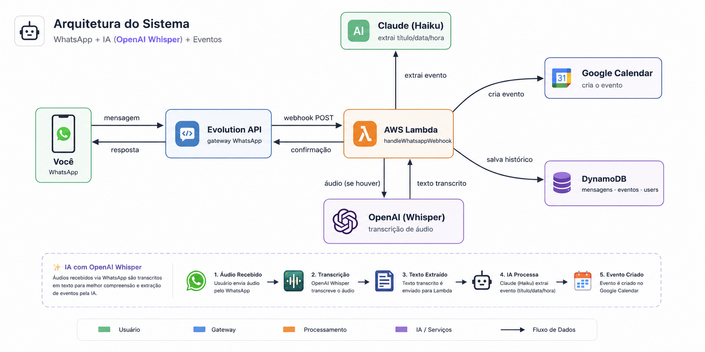

<p align="right">
  <a href="README.pt-BR.md">Português</a> | <a href="README.md">English</a>
</p>

# WhatsNext

[](https://github.com/marcelomds/whatsnext/actions/workflows/ci.yml)

**Assistente de agendamento via WhatsApp usando Claude AI e Google Calendar — rodando de verdade na AWS.**

Manda uma mensagem tipo *"Segunda 14h reunião com João"* pro número conectado, e o
evento aparece sozinho no Google Agenda. Sem app, sem comando de bot — só linguagem
natural.

<p align="center">
  
</p>

<p align="center"><sub>Detalhamento completo (fluxo de dados, schema DynamoDB, escalabilidade): <a href="docs/ARCHITECTURE.md">docs/ARCHITECTURE.md</a></sub></p>

## ✨ Features

- ✅ Número real de WhatsApp, conectado via QR code direto do painel web (Evolution API)
- ✅ Só você por design — só mensagens de `AUTHORIZED_PHONE_NUMBER` são processadas; qualquer outra pessoa que mandar mensagem pro número é ignorada em silêncio, sem resposta automática pra estranhos
- ✅ Mandar mensagem pra si mesmo funciona pra agendar (o padrão "mensagem para você" do WhatsApp é tratado como comando, não como eco)
- ✅ Mensagem em linguagem natural → Claude extrai título, data, hora e duração
- ✅ Áudio também funciona — transcrito via OpenAI Whisper antes de chegar no Claude
- ✅ Evento criado automaticamente no Google Calendar, confirmação enviada de volta no WhatsApp
- ✅ Mensagens sem relação com agendamento (papo, "oi", dizer o próprio nome) são classificadas como `not_an_event` e não recebem resposta nenhuma — só pede esclarecimento quando você realmente tá tentando agendar algo
- ✅ Autenticação JWT (registro/login) — cada conta tem sua própria instância WhatsApp
- ✅ Painel web (React + TypeScript) — tema claro/índigo, alternância de idioma EN/PT, conectar/desconectar WhatsApp, lista de eventos + visão de calendário mensal, card de próximo evento em destaque
- ✅ Deploy real na AWS — backend em Lambda + API Gateway + DynamoDB, frontend em S3 + CloudFront (HTTPS)
- ✅ Stack de dev local via Docker Compose (DynamoDB Local + admin UI)
- ✅ CI/CD via GitHub Actions — testes em todo push, deploy automático na AWS a cada push em `main`

## 🚀 Quick Start (local)

```bash
# 1. Clonar e instalar
git clone https://github.com/marcelomds/whatsnext.git
cd whatsnext
npm install

# 2. Configurar variáveis de ambiente
cp .env.example .env
# preencha o .env com suas credenciais (veja docs/SETUP.md pra saber como conseguir cada uma)

# 3. Subir DynamoDB local + admin UI
docker compose up -d dynamodb-local dynamodb-admin
node scripts/create-dynamodb-tables.js

# 4. Rodar testes
npm test

# 5. Subir o backend (Serverless Offline) — precisa de Node 18 (`nvm use 18`)
npm run dev

# 6. Subir o painel — precisa de Node 20.12+ (`nvm use 20`), diferente do backend
cd apps/frontend && cp .env.example .env && npm install && npm run dev
```

Passo a passo completo: [docs/SETUP.md](docs/SETUP.md).

## 📁 Estrutura do Projeto

```
whatsnext/
├── apps/
│   ├── backend/
│   │   ├── src/
│   │   │   ├── handlers/
│   │   │   │   └── whatsapp-handler.js      (entry points das Lambdas)
│   │   │   ├── controllers/
│   │   │   │   ├── auth.controller.ts       (register/login/me)
│   │   │   │   ├── instance.controller.ts   (connect/status/disconnect)
│   │   │   │   ├── messages.controller.ts
│   │   │   │   └── events.controller.ts
│   │   │   ├── services/
│   │   │   │   ├── claude.service.ts        (integração Claude)
│   │   │   │   ├── calendar.service.ts      (Google Calendar)
│   │   │   │   ├── whatsapp.service.ts      (Evolution API)
│   │   │   │   ├── dynamodb.service.ts      (banco de dados)
│   │   │   │   ├── auth.service.ts          (JWT + bcrypt)
│   │   │   │   └── transcription.service.ts (OpenAI Whisper)
│   │   │   ├── types/
│   │   │   │   └── domain.ts
│   │   │   └── utils/
│   │   │       ├── with-auth.ts             (guarda JWT pros handlers Lambda)
│   │   │       ├── with-cors.ts             (wrapper de headers CORS)
│   │   │       ├── evolution-payload.ts     (parseia o formato real do webhook)
│   │   │       ├── sent-message-cache.ts
│   │   │       ├── vercel-adapter.ts
│   │   │       ├── logger.ts
│   │   │       ├── error-handler.ts
│   │   │       └── validators.ts
│   │   ├── package.json                     (deps de runtime só do backend — deploy fica pequeno)
│   │   ├── docker/Dockerfile
│   │   └── serverless.yml
│   └── frontend/                            (React + TypeScript + Tailwind)
│       └── src/
│           ├── services/                    (wrapper de fetch tipado por recurso da API)
│           ├── hooks/                       (useAuth, useEvents, useConnectInstance, useLanguage...)
│           ├── contexts/                    (AuthContext/AuthProvider, LanguageContext/LanguageProvider)
│           ├── i18n/                        (dicionário de tradução EN/PT)
│           └── features/
│               ├── auth/                    (LoginScreen, RegisterScreen)
│               ├── dashboard/                (NextEventCard, EventsTable, CalendarView)
│               └── connect/                 (pareamento por QR, desconectar)
├── api/                                     (adapter pra Vercel Functions — deploy alternativo)
├── scripts/
│   ├── create-dynamodb-tables.js
│   └── get-google-token.js
├── docs/
│   ├── SETUP.md
│   ├── PROMPTS.md
│   └── assets/architecture.png
├── docker-compose.yml                       (DynamoDB Local + admin UI + api, pra dev local)
├── package.json
└── .env.example
```

## 🔧 Tech Stack

| Camada | Tecnologia |
|--------|-----------|
| **Serverless** | AWS Lambda + API Gateway (Serverless Framework) |
| **Banco de dados** | DynamoDB |
| **Autenticação** | JWT (jsonwebtoken) + bcrypt |
| **IA** | Claude API (Anthropic) — Haiku por padrão |
| **Fala pra texto** | OpenAI Whisper — transcreve áudio antes de chegar no Claude |
| **Calendário** | Google Calendar API (OAuth2) |
| **WhatsApp** | Evolution API |
| **Linguagem backend** | Node.js 18 (`serverless-offline` ainda não roda em 20+) |
| **Frontend** | React 19 + TypeScript + Vite + Tailwind CSS v4 — precisa de Node.js 20.12+ (Vite/Vitest usam `util.styleText`) |
| **Hospedagem frontend** | S3 (privado, OAC) + CloudFront (HTTPS) |
| **Testes** | Jest (backend), Vitest (frontend) |
| **Dev local** | Docker Compose |
| **CI** | GitHub Actions (testes backend + build frontend) |

## 🔌 API

| Método | Rota | Auth | Pra que serve |
|--------|------|------|----------------|
| POST | `/api/auth/register` | – | Cria conta (gera nome de instância Evolution automaticamente) |
| POST | `/api/auth/login` | – | Retorna um JWT |
| GET | `/api/auth/me` | JWT | Usuário autenticado |
| POST | `/api/instance/connect` | JWT | Cria/reconecta sua instância WhatsApp, retorna QR code |
| GET | `/api/instance/status` | JWT | Estado da conexão (`open`, `connecting`, `close`) |
| POST | `/api/instance/disconnect` | JWT | Desconecta a instância WhatsApp |
| POST | `/api/webhooks/whatsapp` | – (chamado pela Evolution) | Onde as mensagens do WhatsApp chegam |
| GET | `/api/messages?phoneNumber=` | – | Histórico de mensagens de um número |
| GET | `/api/events` | – | Eventos criados |
| GET | `/health` | – | Health check |

## 💡 Como Funciona

1. **Mensagem chega no WhatsApp** — *"Segunda 14h reunião com João"* (ou um áudio dizendo a mesma coisa — é transcrito via OpenAI Whisper primeiro, depois tratado igual a texto)
2. **Evolution API chama o webhook** com o formato real do payload (`{event, instance, data: {key, message, messageTimestamp}}`). O endereçamento `@lid` (privacidade) mais novo do WhatsApp é resolvido de volta pro número via `remoteJidAlt`; mensagens de grupo são descartadas; só o *eco* da nossa própria confirmação é filtrado (comparando o ID da mensagem), então uma mensagem mandada pra si mesmo continua sendo tratada como comando real
3. **Remetente é conferido contra `AUTHORIZED_PHONE_NUMBER`** — qualquer outro número é ignorado em silêncio (200 OK, sem resposta, nada é salvo)
4. **Lambda armazena a mensagem** no DynamoDB, depois manda o texto (junto com histórico recente) pro Claude
5. **Claude classifica a mensagem**: `create_event` (tem informação suficiente), `request_clarification` (claramente sobre agendar, mas falta data/hora), ou `not_an_event` (sem relação — papo, um nome, uma pergunta) — só as duas primeiras geram resposta no WhatsApp
6. **Evento é criado** no Google Calendar, status atualizado no DynamoDB, e confirmação enviada de volta no WhatsApp

## 🔐 Segurança

- `.env` / `.env.production` nunca commitados (veja `.gitignore`)
- **`AUTHORIZED_PHONE_NUMBER`**: o webhook só age em mensagens desse número — qualquer outra pessoa que mandar mensagem pro WhatsApp conectado não recebe resposta e nada é salvo. Sem isso, mensagens mal classificadas de terceiros podem disparar respostas automáticas indesejadas (e o próprio WhatsApp pode sinalizar/deslogar um número que aparenta rodar um bot não convidado)
- Senhas com hash bcrypt, sessões são JWT stateless (expira em 30 dias)
- IAM roles por Lambda, restritas exatamente às tabelas/índices DynamoDB que cada uma usa
- Validação de entrada (Joi) em toda mensagem recebida
- Headers de CORS são adicionados explicitamente por toda resposta da Lambda (wrapper `withCors`) — o `cors: true` do API Gateway só cobre o preflight OPTIONS, não a resposta real de GET/POST

## 📦 Deploy

### Backend

Faz deploy real na AWS via Serverless Framework. Produção usa um
`.env.production` separado (nunca o `.env` local — ele aponta pro DynamoDB local
e quebraria na nuvem):

```bash
npm run deploy:prod      # deploy na AWS
npm run logs:prod        # acompanha logs do CloudWatch
npm run status:prod      # info do stack / URLs dos endpoints
npm run remove:prod      # remove o stack
```

Existe também um adapter alternativo pra Vercel Functions em `/api` (veja
`vercel.json`), caso prefira fazer deploy lá em vez da AWS — mesmos controllers,
só o ponto de entrada é mais fino.

### Frontend

Build estático servido de um bucket S3 privado atrás do CloudFront (HTTPS, sem
acesso público ao bucket — o CloudFront alcança o S3 via Origin Access Control):

```bash
cd apps/frontend
# o .env deve apontar VITE_API_URL pra URL do API Gateway de prod, não localhost
npm run build

aws s3 sync dist/ s3://<seu-bucket>/ --delete
aws cloudfront create-invalidation --distribution-id <seu-distribution-id> --paths "/*"
```

O bucket S3 + distribuição CloudFront + Origin Access Control são configurados
uma vez só (a policy do bucket é restrita ao ARN da distribuição CloudFront);
não são recriados a cada deploy, só o sync + invalidation acima.

## 🔄 CI/CD

GitHub Actions (`.github/workflows/ci.yml`) roda o pipeline completo em todo push:

- **CI** — testes do backend (Jest) + testes e build do frontend, em todo push e PR.
- **CD** — em push pra `main`, depois que o CI passa: `deploy-backend` roda `serverless deploy --stage prod`, depois `deploy-frontend` builda com a URL de prod, sincroniza com S3 e invalida o cache do CloudFront. Os comandos manuais acima continuam funcionando pra deploy avulso, mas dar push em `main` já basta sozinho.

Secrets do repositório necessários (**Settings → Secrets and variables → Actions**) — mesmos valores do seu `.env.production`:

| Secret | Usado por |
|--------|-----------|
| `AWS_ACCESS_KEY_ID`, `AWS_SECRET_ACCESS_KEY`, `AWS_REGION`, `AWS_ACCOUNT_ID` | os dois jobs de deploy |
| `JWT_SECRET`, `CLAUDE_API_KEY`, `GOOGLE_CALENDAR_CLIENT_ID`, `GOOGLE_CALENDAR_CLIENT_SECRET`, `GOOGLE_CALENDAR_REFRESH_TOKEN`, `EVOLUTION_API_URL`, `EVOLUTION_API_KEY`, `EVOLUTION_INSTANCE`, `AUTHORIZED_PHONE_NUMBER`, `OPENAI_API_KEY` | `deploy-backend` |
| `VITE_API_URL_PROD`, `S3_BUCKET_NAME`, `CLOUDFRONT_DISTRIBUTION_ID` | `deploy-frontend` |

## 🧪 Testes

```bash
npm test               # backend (Jest)
cd apps/frontend && npm run build   # type-check + build do frontend
```

## 🎯 Roadmap

- [x] Pipeline principal (WhatsApp → Claude → Calendar)
- [x] Persistência no DynamoDB
- [x] Autenticação JWT, instância WhatsApp por usuário
- [x] Painel web (conectar/dashboard)
- [x] Deploy real na AWS, testado ponta a ponta (backend + frontend)
- [x] Autorização só-você (`AUTHORIZED_PHONE_NUMBER`) + silêncio pra mensagens sem relação
- [x] Painel web EN/PT com visão de calendário + destaque do próximo evento
- [x] Transcrição de mensagens de áudio
- [x] CD — deploy automático na AWS a cada push em `main`

## 🐛 Troubleshooting

Veja [docs/SETUP.md](docs/SETUP.md#-troubleshooting).

## 📄 Licença

MIT
